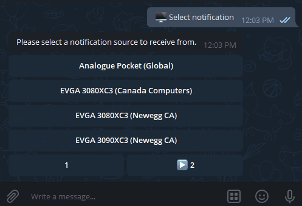

# sentrybot


A Telegram bot to watch website changes

Easy to config with yaml rules and support website and api change monitoring.

Feel free to add your own rule and start watching!



## Motivation

The RTX 3080 launch was a shit show, the site was infested with bots and the stock was sold to mainly scalpers seconds before we even saw a checkout button. To give normal users an edge over the bots, I made this website monitor, it will notify you through telegram when a site changes according to your rules. After running the bot for 1-week, and missed on couple drops of resupply. I was able to purchase an card with the help of this bot.

## What will this do

Notifications on website changes, no automatic checkout (its enough)

## Installation

```
> git clone git remote add origin git@github.com:r1cebank/sentrybot.git
> cd sentrybot
> npm i
```

## Running

To run this, you simply provide the `TELEGRAM_BOT_TOKEN` as an environment variable and run it.

```
TELEGRAM_BOT_TOKEN=xxxxx:xxxxx npm run dev

or

npm run build
TELEGRAM_BOT_TOKEN=xxxxx:xxxxx node build/main
```

## Commands

`/start` to enable the bot, must send to use, otherwise there is not way bot can communicate with you

`/status` get the current status of the watcher

## Custom keyboard

After sending `/start` bot will give you option to choose from a list of notification sources, tap on the inline button to enable them.

Once the notification is enabled, the bot will start watching them for changes defined in the `rules` folder.

## Known Issues

I was able to track down most of the OOM issues, but this bot still have some sneaky memory leak, around 61MB won't freed running overnight. (from puppeteer script injecting). But hopefully it shouldn't cause too much issues for you.

## Contributing

Feel free to fork and add your own rules or add your own rules and submit a PR, I will merge them in no time.
